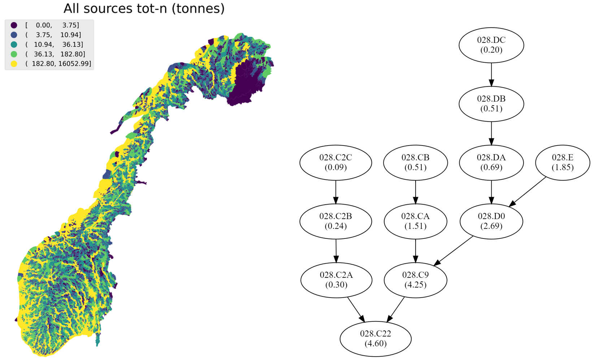

# TEOTIL2 - A simple model for estimating riverine fluxes

TEOTIL2 is a simple, export-coefficient-based model for estimating riverine fluxes. The model makes it easy to define a catchment network, assign local inputs to subcatchments, and accumulate fluxes downstream (allowing for retention in subcatchments, if desired).

The original TEOTIL model for nutrients (total nitrogen and phosphorus) was developed by [Tjomsland *et al*. (2010)](https://niva.brage.unit.no/niva-xmlui/handle/11250/214825) and has been widely used in Norway for simulating nutrient fluxes at national scale - for example as part of Miljødirektoratet's [Elveovervåkingsprogrammet](https://github.com/JamesSample/rid) and for reporting to the [OSPAR Commission](https://www.ospar.org/).

This repository contains a Python implementation TEOTIL, named TEOTIL2. The new version of the model has a more flexible and generic structure, but uses broadly the same input datasets as previously and aims to recreate outputs from the original model as closely as possible (see the links below for a comparison). All calculations have been restructured using [networkx](https://networkx.org/) to significantly improve computational performance.

This repository also includes code for **TEOTIL2 Metals**, an extension of the original model that uses the same principles to simulate fluxes of arsenic (As), cadmium (Cd), copper (Cu), chromium (Cr), lead (Pb), mercury (Hg), nickel (Ni) and zinc (Zn).

All the examples make use of Norway's ["regine" catchment network](https://kartkatalog.geonorge.no/metadata/regine-enhet/8721cdac-f959-4adc-9d54-d3b770e5fa1e) for flux calculations at national scale, but the model can also be used with user-specified catchments.

  

## Installation

**To do**

## Documentation and tutorials

 * [TEOTIL2 basic concepts](https://nbviewer.jupyter.org/github/NIVANorge/teotil2/blob/main/notebooks/01_teotil2_basics.ipynb)

 * [An introduction to TEOTIL2 (nutrients)](https://nbviewer.jupyter.org/github/NIVANorge/teotil2/blob/main/notebooks/02_teotil2_nutrients.ipynb)
 
 * [Running TEOTIL2 (nutrients) for multiple years](https://nbviewer.jupyter.org/github/NIVANorge/teotil2/blob/main/notebooks/03_run_nutrients_all_years.ipynb)
 
 * [An introduction to TEOTIL2 (metals)](https://nbviewer.jupyter.org/github/NIVANorge/teotil2/blob/main/notebooks/04_teotil2_metals.ipynb)
 
 * [Running TEOTIL2 (metals) for multiple years](https://nbviewer.jupyter.org/github/NIVANorge/teotil2/blob/main/notebooks/05_run_metals_all_years.ipynb)
 
 * [Explore time series from TEOTIL2 (metals)](https://nbviewer.jupyter.org/github/NIVANorge/teotil2/blob/main/notebooks/06_explore_teotil2_metals_output.ipynb)

## Reports and technical information

 * [Report for the original TEOTIL model (version 1) by Tjomsland *et al*. (2010)](https://niva.brage.unit.no/niva-xmlui/handle/11250/214825)
 
 * [TEOTIL2 (metals) development report (2020)](./pages/00_intro_and_toc.html)

## Development notebooks

 * [Interpolation of datasets and preliminary statistical analysis](https://nbviewer.jupyter.org/github/NIVANorge/teotil2/blob/main/notebooks/dev02_teotil2_metals_interp_and_regress.ipynb)
 
 * [Incorporating the 2019 "1000 Lakes" dataset](https://nbviewer.jupyter.org/github/NIVANorge/teotil2/blob/main/notebooks/dev03_teotil2_metals_1k_lakes_2019.ipynb)
 
 * [Exploring changes over time](https://nbviewer.jupyter.org/github/NIVANorge/teotil2/blob/main/notebooks/dev04_teotil2_metals_over_time.ipynb)