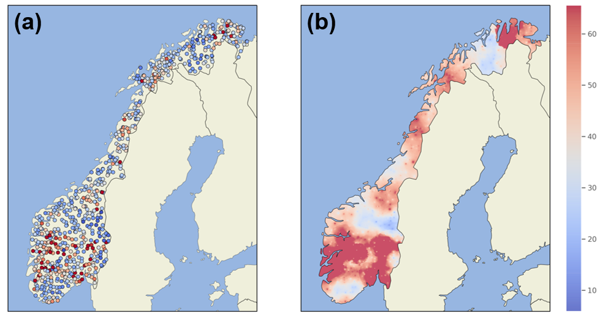
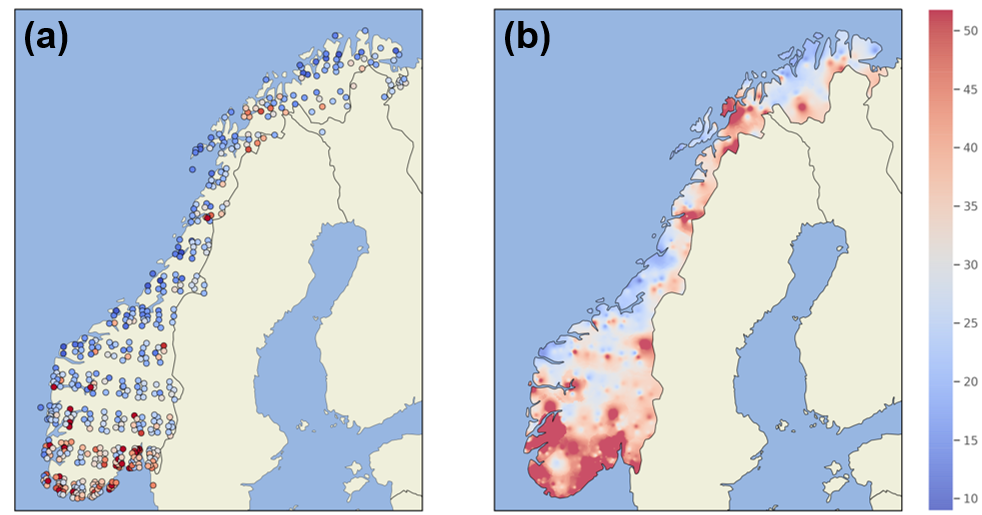
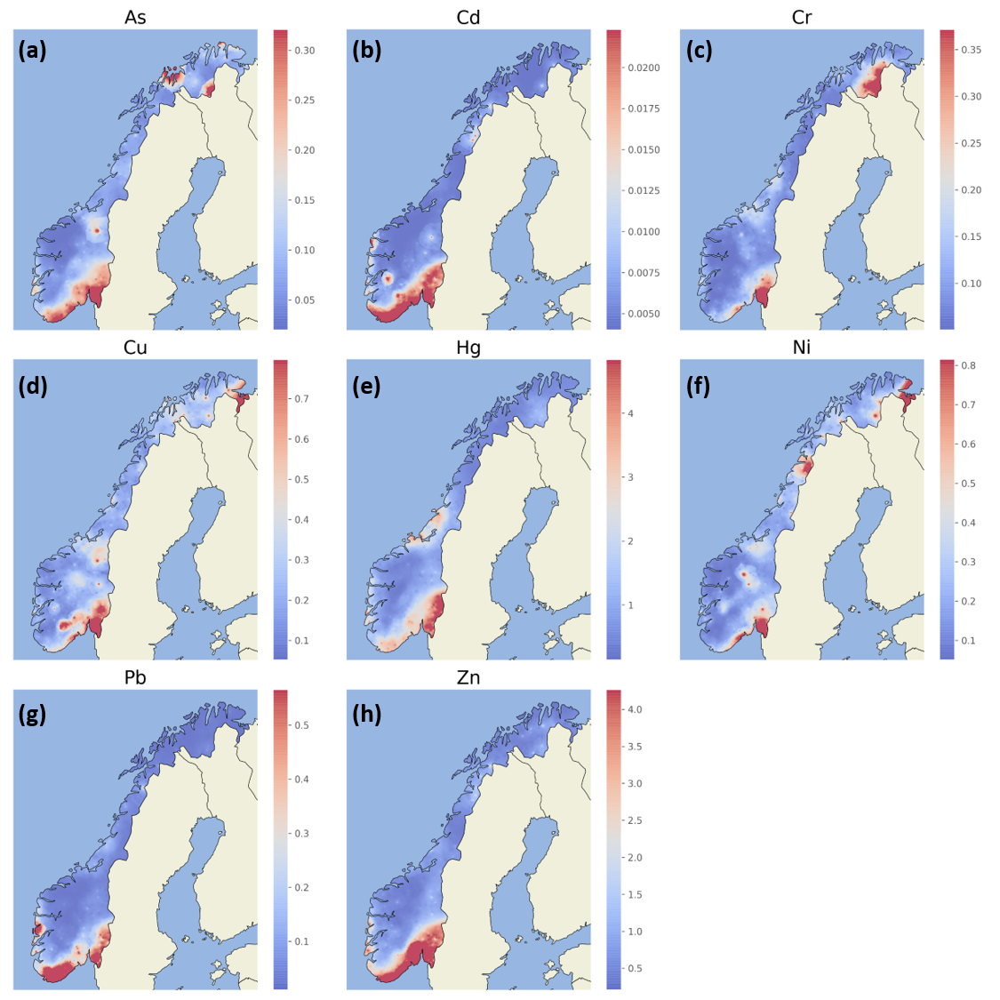

## 3.1. Estimating local inputs

Estimating annual local inputs of metals to each regine catchment requires information describing both point and diffuse sources. Data for point sources can be obtained from the Norwegian Environment Agency’s discharge licensing database (as for nutrients), but diffuse inputs must be inferred from other datasets. Based on the discussion in [Section 1](01_metal_behaviour.html), key datasets are those describing geology, atmospheric deposition, water chemistry and hydrology. To be of practical use, candidate datasets must meet the following criteria:

 * Be available for most or all of the metals of interest

 * Be available at national scale

 * Be updated with a frequency that reflects the variable’s natural rate of change

### 3.1.1. Geology

The most comprehensive geological datasets available at national scale come from the Geochemical Atlas complied by the Norwegian Geological Survey (NGU; [Ottesen *et al*., 2000](https://www.ngu.no/publikasjon/geokjemisk-atlas-norge-del-1)). Raw point data for six of the eight metals of interest (As, Cr, Cu, Ni, Pb and Zn) were supplied by Tor Erik Finne at NGU. Data were collected during 1984-85 and represent metal concentrations measured in flood sediments at 690 locations across Norway. For the purposes of this report, they are assumed to be representative of concentrations in locally eroded material transported by rivers. It is further assumed that these concentrations remain constant over time, so the local geological inputs to each catchment are proportional to the amount of weathering and erosion, which is linked to hydrology (Section 3.1.4, below).

The raw point data for geochemistry has been spatially interpolated onto a common grid using Inverse Distance Weighting (IDW; see [here](https://nbviewer.jupyter.org/github/NIVANorge/teotil2/blob/main/notebooks/dev02_teotil2_metals_interp_and_regress.ipynb) for details). An example for zinc is shown in *Fig. 2*.

  

 
***Fig. 2:*** Geochemical data from flood sediments for zinc (mg/kg). (a) Raw point data from NGU; (b) Spatially interpolated using Inverse Distance Weighting

### 3.1.2. Atmospheric deposition

Estimates of atmospheric deposition based on dynamic modelling are available from [EMEP](http://www.emep.int/), but only for Cd, Hg and Pb. For the other metals of interest (As, Cr, Cu, Ni and Zn), the best available data come from measurements of concentrations in mosses, which aggregate deposition inputs over periods of about a year ([Skjelkvåle *et al*., 2006](https://niva.brage.unit.no/niva-xmlui/handle/11250/213255)). 

Model results from EMEP are produced every year, while the moss surveys have been conducted every 5 years since 1985. Lab methods and limits of detection have improved substantially in the more recent moss surveys, but the number of sites sampled has also reduced. The dataset from 2005 therefore seems to provide the most complete picture in terms of spatial coverage and measurement accuracy.

Raw point datasets from the moss surveys were made available by Eiliv Steinnes at NTNU. The same [IDW interpolation procedure](https://nbviewer.jupyter.org/github/NIVANorge/teotil2/blob/main/notebooks/dev02_teotil2_metals_interp_and_regress.ipynb) used for geochemistry was applied to translate values onto a common grid (*Fig. 3*).

  

***Fig. 3:*** Zinc concentrations measured in mosses in 1990 (mg/kg). (a) Raw point data; (b) Spatially interpolated using Inverse Distance Weighting

### 3.1.3. Water chemistry

National surveys of Norwegian water chemistry took place in 1986, 1995 and 2019. The 2019 "1000 Lakes" survey considered all the metals of interest in this report, while the 1995 survey included all except mercury. pH and TOC were also measured, making it possible to explore effects such as acidification and organic matter complexation.

Analytical methods used in the 2019 survey have imporved considerably since 1995: a key limitation of the earlier survey datasets is that measured concentrations are frequently low compared to laboratory limits of detection (LODs). *Table 2* shows the proportion of samples from the 1995 survey that were at or below the LOD for seven metals, plus TOC.

|   Element   |   Number of samples   |   Number ≤ LOD   |   Percent ≤ LOD   |
|:-----------:|:---------------------:|:----------------:|:-----------------:|
|        As   |                   504 |              328 |                65 |
|        Cd   |                   970 |              610 |                63 |
|        Cr   |                   970 |              648 |                67 |
|        Cu   |                   971 |              261 |                27 |
|        Ni   |                   971 |              180 |                19 |
|        Pb   |                   969 |               37 |                 4 |
|        Zn   |                   970 |               87 |                 9 |
|       TOC   |                  1007 |               81 |                 8 |

***Table 2:*** Proportion of limit of detection (LOD) values from the 1995 lake chemistry survey. TOC, total organic carbon   

To develop a robust implementation of TEOTIL Metals, it is necessary to estimate inputs of metals to each regine catchment. Obvious ways of doing this are either (i) deriving statistical relationships linking geological and atmospheric datasets to water chemistry, or (ii) using the water chemistry datasets directly to infer catchment concentrations. However, for either approach, deriving meaningful quantitative relationships is difficult when a significant proportion of the data are censored (and this is especially true when more than 50% of the data are censored, because even simple descriptive statistics — like the median — become difficult to estimate). *Table 2* makes it clear that, from the national survey data available, only the 2019 survey will be useful in the context of developing TEOTIL Metals.

The best available datasets describing metal concentrations through time are those collected as part of [Elveovervåkingsprogrammet](https://www.miljodirektoratet.no/om-oss/roller/miljoovervaking/overvakingsprogrammer/basisovervaking/elveovervakningsprogrammet/). Since 1990, 155 major Norwegian rivers have been monitored within this programme, and since 2017 a subset of 20 of these has been sampled and analysed four times per year for heavy metals. 

Raw point datasets from the 2019 1000 Lakes survey were [interpolated using the same procedure](https://nbviewer.jupyter.org/github/NIVANorge/teotil2/blob/main/notebooks/dev03_teotil2_metals_1k_lakes_2019.ipynb#3.-Read-1000-lakes-data-for-2019) as for mosses and geochemistry. The interpolated grids for each metal are shown in *Fig. 4*.

  

***Fig. 4:*** Water chemistry from the 2019 1000 Lakes survey, spatially interpolated using Inverse Distance Weighting. All units are μg/l except mercury, which is ng/l.

### 3.1.4. Hydrology

As part of Elveovervåkingsprogrammet, national scale hydrology data are supplied annually by the [Norwegian Water Resources and Energy Directorate (NVE)](https://www.nve.no/) and incorporated into the existing TEOTIL model for N and P. For TEOTIL Metals, hydrology plays an important role in determining weathering and mobilisation, and making it possible to translate metal concentrations in the geochemical, moss or water chemistry datasets into riverine fluxes. Hydrological parameters such as specific runoff and catchment residence time are also required to derive estimates of retention ([Section 3.2](05_retention.html)).

\
\
\
<<[Previous](03_teotil_metals.html) --------- [Contents](00_intro_and_toc.html) --------- [Next](05_retention.html)>>

        [Home](https://nivanorge.github.io/teotil2/)