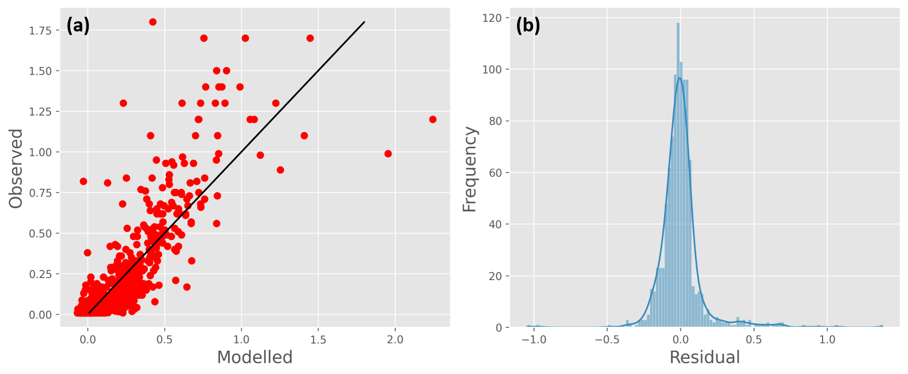

## 3.3. Statistical relationships

TEOTIL Metals is underpinned by the idea that significant relationships exist between key sources/drivers of metal inputs (geology, atmospheric deposition, hydrology and point discharges) and the fluxes observed in surface waters. To test this, statistical models were developed linking the 2019 national water chemistry dataset to a range of possible explanatory variables (full details and code are [here](https://nbviewer.jupyter.org/github/NIVANorge/teotil2/blob/main/notebooks/dev02_teotil2_metals_interp_and_regress.ipynb)). The analysis considered only the metals As, Cr, Cu, Ni, Pb and Zn; Cd and Hg were not considered, as they are missing from one or more of the required input datasets. The following variables were incorporated:

 * **Water chemistry**. Concentrations of metals [μg/l], plus TOC [mgC/l] and pH [-] were extracted from the database for the 2019 lake survey. Catchment boundaries representing the area upstream of each sampling location were also calculated

 * **Geology**. The mean metal concentration [mg/kg] measured in river sediments was calculated for each catchment by averaging IDW interpolated values within each catchment boundary (*[Fig. 2b](https://nivanorge.github.io/teotil2/pages/04_local_inputs.html)*)

 * **Atmospheric deposition**. The IDW interpolated moss dataset from 2005 (*[Fig. 3b](https://nivanorge.github.io/teotil2/pages/04_local_inputs.html)*) was averaged over each catchment to obtain values proportional to deposition inputs [mg/kg]. The 2005 dataset was chosen because later moss surveys contain fewer sampling points (see [Section 3.1.2](04_local_inputs.html))

### 3.3.1. Exploratory data analysis

Scatter plots with lowess smoothing were used to summarise relationships between variables and to highlight general trends (see [here](https://nbviewer.jupyter.org/github/JamesSample/rid/blob/master/notebooks/nope_metals_3.ipynb#8.1.-Data-exploration) and [here](https://nbviewer.jupyter.org/github/NIVANorge/teotil2/blob/main/notebooks/dev02_teotil2_metals_interp_and_regress.ipynb#7.-Regression) for details). Although there is a lot of noise, the smoothing picks out plausible relationships: most metal concentrations are higher in organic carbon-rich or acidic conditions, and there are clear positive relationships with deposition (mosses) and geology (river sediments). Furthermore, in some cases the relationship with pH approximates exponential decay, which can be linearised by converting from pH units to the concentration of $$H^+$$ ions

$$
[H^+] = 10^{-pH} \quad \quad \quad (10)
$$

When this is done, the relationships on the scatter plots are all approximately linear, suggesting multiple linear regression as an appropriate tool for further analysis.

### 3.3.2. Multiple linear regression

Multiple linear regression models of the following form were fitted for each metal, $$X$$

$$
C_i^X= \beta_0^X + \beta_1^X M_i^X + \beta_2^X G_i^X + \beta_3^X C_i^{TOC} + \beta_4^X C_i^{H^+} \quad \quad \quad (11)
$$

Where $$C_i^X$$ is the concentration of metal $$X$$ in lake $$i$$; $$M_i^X$$ is the average concentration of $$X$$ in mosses in catchment $$i$$; $$G_i^X$$ is the average concentration of $$X$$ in river sediments in catchment $$i$$; $$C_i^{TOC}$$ is the concentration of TOC in lake $$i$$; $$C_i^{H^+}$$ is the concentration of $$H^+$$ ions in lake $$i$$ (estimated using equation [10]) and the $$\beta_j^X$$ are the regression parameters for each metal.

All variables were standardised prior to regression and a "best subsets" approach applied to find the model with the lowest AIC from all possible combinations of the four explanatory variables. Note that, in general, best subsets is prone to overfitting the data (regularised techniques such as lasso or ridge regression are usually preferable), but it does provide a useful comparison to the "full" model, which is of interest here.

*Fig. 5a* shows the fitted versus observed values for Pb for the “best” model identified. This model explains roughly 70% of the data variance ($$R^2 = 0.70$$) and the residuals (*Fig. 5b*) are approximately normally distributed. All variables are highly significant ($$p ≪ 0.05$$) and the model coefficients are plausible, indicating that Pb has positive relationships with both geological and atmospheric inputs, as well as with concentrations of organic matter and $$H^+$$. Looking at the standardised coefficients (*Table 3*), the concentration of $$H^+$$ has the biggest effect size, followed by concentration of TOC, geochemistry and, finally, mosses (i.e. deposition). These results are broadly consistent with the literature survey in [Section 1](01_metal_behaviour.html), which states that lead concentrations in Norway are affected by LRTAP, but strongly modified by pH and complexation with organic matter (*[Table 1](01_metal_behaviour.html)*).

  

***Fig. 5:*** Multiple linear regression results for Pb. (a) Observed versus modelled values (note the black line is the 1:1 line, not the line of best fit); (b) distribution of residuals

|   Variable   |  Slope | p-value |
|:------------:|:------:|:-------:|
|     const    | 0.1637 |       0 |
| moss_mean_pb | 0.0267 |       0 |
| geol_mean_pb | 0.0674 |       0 |
|   TOC_mgC/l  | 0.0770 |       0 |
|      hp      | 0.1433 |       0 |

***Table 3:*** Standardised regression coefficients and p-values for the regression model in *Fig. 5*

Detailed regression results for all metals considered can be found [here](https://nbviewer.jupyter.org/github/NIVANorge/teotil2/blob/main/notebooks/dev02_teotil2_metals_interp_and_regress.ipynb#7.-Regression). Although all relationships are highly statistically significant, and most are physically plausible, the explanatory power for several of the metals is poor (i.e. the effect size is small/negligible). Furthermore, in most cases, **the effects of other water chemistry parameters (especially TOC concentration) are more important than either the moss or geochemistry variables**. This is problematic, because TEOTIL enforces a simple conceptual framework that is incapable of representing such "process-based" or "mechanistic" effects¹. Restricting the statistical models to only consider the moss and geochemistry datasets yields very poor relationships and, since we do not have national scale datasets of pH and TOC through time (the "1000 Lakes" surveys are 20 years apart), it will not possible to use these relationships to effectively estimate regine-scale catchment inputs from the moss and geochemistry data. The alternative approach of directly estimating catchment metal concentrations from the 2019 1000 Lakes dataset must therefore be explored in more detail.

 
 
 

------------------
¹Similar problems have been documented with the original TEOTIL model when simulating phosphorus: because a significant fraction of the P-load is typically bound to particulates, the model performs poorly compared to nitrogen (where most of the flux is dissolved).

\
\
\
<<[Previous](05_retention.html) --------- [Contents](00_intro_and_toc.html) --------- [Next](07_1000_lakes.html)>>

        [Home](https://nivanorge.github.io/teotil2/)

