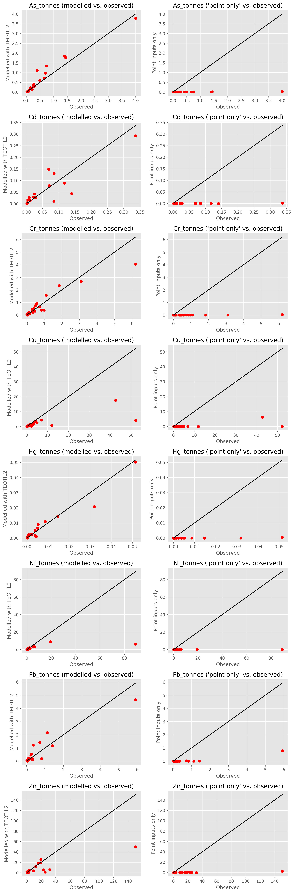
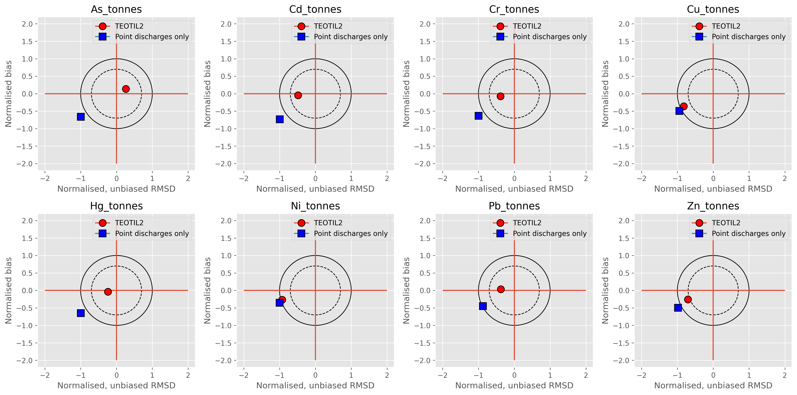

## 3.4. Direct estimates of metal concentrations

Poor statistical relationships (except when incorporating pH and TOC) and incomplete historic datasets make it difficult to use the moss and geochemistry surveys to derive export coefficients and retention factors for TEOTIL2 Metals ([Section 3.3](06_statistical_relationships.html)). However, the 2019 1000 Lakes survey provides a detailed picture of the spatial distribution of metal concentrations in Norwegian freshwaters. To some extent, this dataset can be used to bypass challenges with the moss and geochemistry data: since we already know the concentrations in surface waters, it is not necessary to allow for catchment level retention (i.e. retention can be assumed to be 0; [Section 3.2.2](05_retention.html)); it is also no longer necessary to derive export coefficients from the "geology" and "depositon" datasets, because direct estimates of concentrations are available instead.

The downside of this approach is that it cannot distinguish between inputs from bedrock weathering versus atmospheric deposition. This is unfortunate, as one of the main benefits of models such as TEOTIL is the ability to perform "source apportionment" i.e. to separate total fluxes into several contributing components. However, in the case of TEOTIL Metals, we have no chocie but to assume that geochemical concentrations are constant, because there is only one geochemical survey (from 1984/5). Rather than attempting to separate the bedrock weathering and atmospheric depositon components using poor statistical relationships, it may therefore be better to estimate the combined (weathering + deposition) component directly from the water chemistry data, and then further assume that changes in this component are driven primarily by atmospheric depositon. This approach simultaneously solves the problems of estimating retention factors and export coefficients and, although conceptually different to the way nutrients are handled in TEOTIL, it is similar to how the model estimates catchment-level water fluxes.

### 3.4.1. 2019 concentrations from the "1000 Lakes" survey

Metal concentrations measured during the 2019 1000 Lakes survey are assumed to reflect a combination of point discharges (e.g. from industry) and diffuse inputs from bedrock weathering and atmospheric depositon. The notebook [here](https://nbviewer.jupyter.org/github/NIVANorge/teotil2/blob/main/notebooks/dev03_teotil2_metals_1k_lakes_2019.ipynb) first identifies 947 stations from the 1000 Lakes dataset with no upstream point discharges based on data supplied by the Norwegian Environment Agency. Data from just these lakes was [spatially interpolated using inverse distance weighting (IDW)](https://nbviewer.jupyter.org/github/NIVANorge/teotil2/blob/main/notebooks/dev03_teotil2_metals_1k_lakes_2019.ipynb#4.-Interpolate-1000-Lakes-dataset), and mean concentrations calculated for each metal in each regine catchment using [zonal statistics](https://nbviewer.jupyter.org/github/NIVANorge/teotil2/blob/main/notebooks/dev03_teotil2_metals_1k_lakes_2019.ipynb#7.-Zonal-statistics).

A [prototype TEOTIL2 Metals model](https://nbviewer.jupyter.org/github/NIVANorge/teotil2/blob/main/notebooks/dev03_teotil2_metals_1k_lakes_2019.ipynb#8.-Build-and-test-TEOTIL2-model-for-metals-in-2019) for 2019 was constructed by combining the estimated "diffuse" inputs with data on point discharges. This model was then used to simulate fluxes for the 20 "main rivers" monitoried as part of Elveovervåkingsprogrammet during 2019. *Fig. 6* compares output from this experimental TEOTIL2 model with observed fluxes (left column), and also shows results obtained by simply summing all point discharges, which is the current method used for e.g. OSPAR reporting (right column).

  

***Fig. 6:*** The left column of plots shows output from TEOTIL2 Metals for 2019; the right column is the sum of point discharges only (i.e. the current "default" method for OSPAR reporting). The x-axis in all plots shows observed fluxes calcuated as part of Elveovervåkingsprogrammet; black lines show 1:1 relationships for comparison.

*Fig. 7* shows the same data but this time as a set of "target plots". These provide a convenient way of summarising and comparing the performance of different models: the y-axis shows normalised bias between simulated and observed values; the x-axis is the unbiased, normalised root mean square difference (RMSD); and the distance between any point and the origin is the normalised total RMSD. The solid circle highlights $$RMSD = 1$$, and any point within this has positively correlated simulated and observed data series and positive [Nash-Sutcliffe model efficiency](https://en.wikipedia.org/wiki/Nash%E2%80%93Sutcliffe_model_efficiency_coefficient). The dashed circle marks $$RMSD = 0.7$$, and is chosen because the area within this is approximately equal to the area of the outer "donut". **Better models will plot closer to the centre of the target**.

  

***Fig. 7:*** Target plots comparing the perfomance of the new model (red circles) to the "default" approach of summing point discharges (blue squares)

It is clear from these plots that TEOTIL2 Metals implemented using the 1000 Lakes dataset is substantially better than the current "default" workflow for 2019: scatter plots for the new model show clear positive correlations for most metals, with slopes that are close to 1 in five out of eight cases. By contrast, using only point discharges dramatically underestimates observed fluxes (which is not surprising). The target plots also clearly illustrate the improved performance of the new model, which has normalised, total $$RMSD < 1$$ for all metals.

Interestingly, both sets of plots show the new model consistently underestimating metal fluxes for nickel and copper, especially in the largest rivers. These two metals exhibit similar behaviour in the natural environment, with fluxes usually dominated by geological inputs (*[Table 1](01_metal_behaviour.html)*). Further investigation reveals that many of the "outlier" points for Cu and Ni are actually from a single river - Pasvikelva (regine 246.A5). This implies that either (i) mean metal concentrations estimated from the 1000 Lakes dataset do not accurately represent mean "diffuse-source" geological contributions in this catchment, or (ii) substantial inputs from point sources (e.g. industry or mining) have not been accounted for in this area.

### 3.4.2. Changing concentrations through time

The 1000 Lakes dataset shows the *spatial* distribution of metal concentrations during 2019, but one of the main uses of TEOTIL2 is to simulate annual riverine fluxes *over time*. It is therefore necessary to consider temporal - as well as spatial - changes.

The best available monitoring data showing changing metal concentrations over time is collected as part of Elveovervåkingsprogrammet. 11 rivers have been consistently monitored since the 1990s, and less complete data exist from 144 other rivers. For the purposes of OSPAR reporting, data from these rivers are grouped into four hydrologically determined "maritime regions", illustrated in *Fig. 8*. *Table 4* shows how these areas relate to the 262 "vassdragsområder" [defined by NVE](https://www.nve.no/karttjenester/kartdata/vassdragsdata/nedborfelt-regine/). 

  

***Fig. 8:*** Map of the four Norwegian maritime areas defined for OSPAR reporting: Skagerrak, North Sea, Norwegian Sea and Lofoten-Barents Sea

|     OSPAR region    | OSPAR vassdragsområder  | Additional vassdragsområder  |
|:-------------------:|:-----------------------:|:----------------------------:|
|      Skagerrak      |         1 to 23         |          309 to 315          |
|      North Sea      |         24 to 90        |                              |
|    Norwegian Sea    |        91 to 170        |          303 to 308          |
| Lofoten-Barents Sea |        171 to 247       |          301 to 302          |

***Table 4:*** Vassdragsområder associated with the four maritime regions defined for OSPAR reporting. Note that the official OSPAR regions do not include 15 catchments (301 to 315) that drain to Sweden (see *Fig. 8*), but for TEOTIL Metals these catchments have been assigned to the nearest OSPAR area

In order to model temporal changes using TEOTIL Metals, the observed data for each metal and each maritime area were aggregated to produce a single time series for each metal representative of each region. Data gaps were filled by linear interpolation, and a moving median filter (with a window width of three years) was applied to each aggregated series to remove extreme spikes, which appear to be due to issues with the monitoring data in some years. The resulting annual time series for each metal and region were expressed relative to the observed value in 2019, giving a series of "change factors" for each region that could be applied to the spatially interpolated dataset from the 1000 Lakes survey. In this way, the detailed spatial patterns from the 2019 survey are preserved, but modified through time based on regional historic trends. Full details of the workflow are given [here](https://nbviewer.jupyter.org/github/NIVANorge/teotil2/blob/main/notebooks/dev04_teotil2_metals_over_time.ipynb) and the time series of change factors derived for each parameter in each region are shown in *Fig. 9*.

  

***Fig. 9:*** Smoothed, average annual time series for each parameter in each OSPAR region, relative to 2019 values. Based on data from Elveovervåkingsprogrammet

The spatio-temporal version of TEOTIL Metals was used to simulate metal fluxes for the 20 "main rivers" currently monitored under Elveovervåkingsprogrammet. These rivers have been sampled quarterly for metals since 2017 and therefore have reasonably consistent estimates of measured fluxes. *Table 5* shows a summary of the model skill based on comparison of simulated and observed values for 2017 to 2019 inclusive. Further details, including scatter plots and target plots, can be found [here](https://nbviewer.jupyter.org/github/NIVANorge/teotil2/blob/main/notebooks/04_teotil2_metals.ipynb#4.3.-Visualise-results).

| Metal | Regression slope |  R²  |  p-value |
|:-----:|:----------------:|:----:|:--------:|
|   As  |             0.95 | 0.93 | 7.86e-36 |
|   Cd  |             0.82 | 0.77 | 1.35e-18 |
|   Cr  |             1.15 | 0.91 | 6.78e-33 |
|   Cu  |             2.44 | 0.32 | 1.88e-06 |
|   Hg  |             0.89 | 0.91 | 5.74e-20 |
|   Ni  |             4.59 | 0.40 | 4.99e-08 |
|   Pb  |             0.77 | 0.83 | 3.45e-24 |
|   Zn  |             1.51 | 0.72 | 3.77e-18 |

***Table 5:*** OLS linear regression results (without intercept term) for observed versus modelled values for the 20 "main rivers" monitored under Elveovervåkingsprogrammet for 2017 to 2019. Good models should have regression slopes and R² values close to 1. See also the plots [here](https://nbviewer.jupyter.org/github/NIVANorge/teotil2/blob/main/notebooks/04_teotil2_metals.ipynb#4.-Comparison-to-observed-data)

For six out of eight metals, the performance of TEOTIL2 seems promising: all relationships are highly significant ($$p << 0.05$$); the slopes of the regressions are close to 1 with zero intercept; and $$R^2$$ is in the range from 72 to 93%. The target and scatter plots [here](https://nbviewer.jupyter.org/github/NIVANorge/teotil2/blob/main/notebooks/04_teotil2_metals.ipynb#4.-Comparison-to-observed-data) also demonstrate the new model is substantially better than the default approach of simply summing point discharges. As described in Section 3.4.1, above, model performance remains poor for copper and nickel in some rivers - especially Pasvikelva. This appears to be due to missing point discharges in the input datasets.

### 3.4.3. National scale simulations for 1990 to 2019

The new TEOTIL2 Metals model was used to simulate fluxes for the entire regine catchment network for the whole period from 1990 to 2019. Results are explored [here](https://nbviewer.jupyter.org/github/NIVANorge/teotil2/blob/main/notebooks/06_explore_teotil2_metals_output.ipynb), by comparing modelled fluxes with those from the 11 stations within Elveovervåkingsprogrammet with the most detailed monitoring data. *Fig. 10* shows modelled versus observed annual time series for each of these stations.

  

***Fig. 10:*** Simulated (red) and observed (blue) annual time series (1990 to 2019) for each metal for the 11 rivers within Elveovervåkingsprogrammet with the most detailed monitoring data. A larger version of this plot can be viewed and downloaded [here](https://github.com/NIVANorge/teotil2/blob/main/plots/metals/results/mod_vs_obs_time_series_rid11_1990-2019.png)

Overall, the model is capable of capturing the main spatial and temporal patterns observed in most rivers, although it fails to reproduce much of the temporal detail. This is to be expected, as the only complete datasets representing temporal changes are available at regional - rather than local - scale. However, in several cases where there are large discrepancies between observed and simulated historic values, the most likely source of error seems to be the observed data, rather than the simulations: some of the observed (blue) curves on *Fig. 10* show isolated high spikes (e.g. Pb in regine 002.A51; Glomma), which are unlikely to be genuine. Similarly, very high spikes in the simulated data (red curves on *Fig. 10*), such as those for Hg in regine 002.A51 (Glomma) during 2004 and 2006, are caused by dramatic but isolated increases in point discharges from industrial sites upstream, as recorded by Miljødirektoratet's discharge licensing database. Since these increases are both large and short-lived, and as they are not reflected in the river monitoring data, it seems likely that these spikes are caused by problems (most likely unit conversion errors) in the reporting of industrial discharges. One option for improving the model further is therefore to undertake a more thorough review of the point discharges used to generate input files.

Finally, although the model performs adequately for most rivers, there are some locations, most notably vassdragsområder 006 (Alna) and 028 (Orreelva), where the model dramatically underestimates both the mean and variability of observed fluxes. For Alna this is unsurprising, as the model does not explicitly include urban inputs and these are likely to be substantial from a large city such as Oslo, but for Orreelva the causes are currently unknown.

Despite these limitations, TEOTIL2 Metals seems capable of producing plausible simulations of metal fluxes in most locations for the period from 1990 to 2019. The model is simple and fast (run times are typically less than 10 seconds) and results are clearly better than the current approach of considering only point discharges. It is also straightforward to use the model to simulate fluxes for future years by extending the time series of change factors as new data become available (e.g. from Elveovervåkingsprogrammet). To make this process easier, the function `io.estimate_metal_change_factors_over_time()` automates the calculation procedure (but requires a direct connection to NIVA's water chemistry database). 

\
\
\
<<[Previous](06_statistical_relationships.html) --------- [Contents](00_intro_and_toc.html) --------- [Next](08_conclusion.html)>>

[Home](https://nivanorge.github.io/teotil2/)

